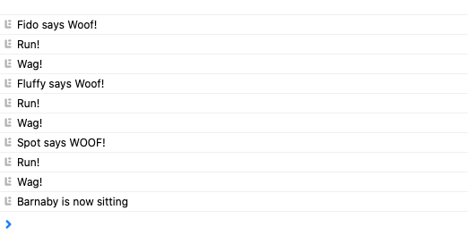
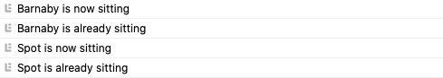

# HfJsChap13

From the book Head First Javascript Chapter 13

______________________________________________

dogs.html -> classes

______________________________________________

robots.html -> more classes

______________________________________________

robotGame.html -> more classes

______________________________________________

dogs.html -> more classes

